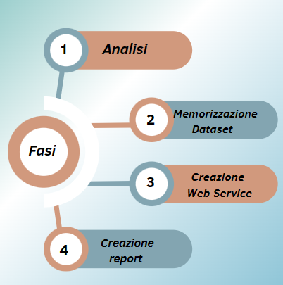
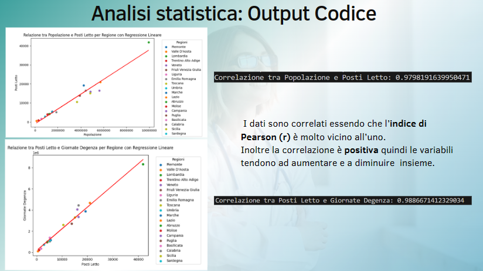
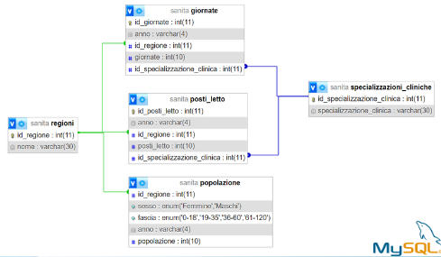
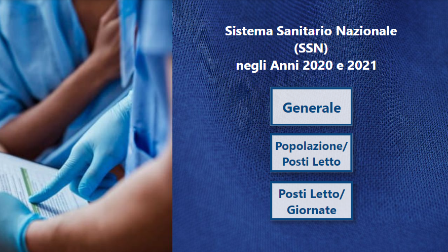
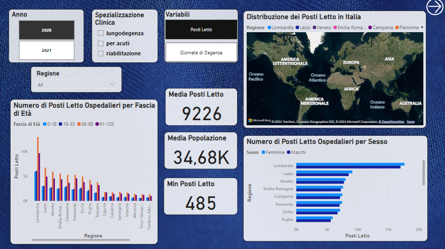
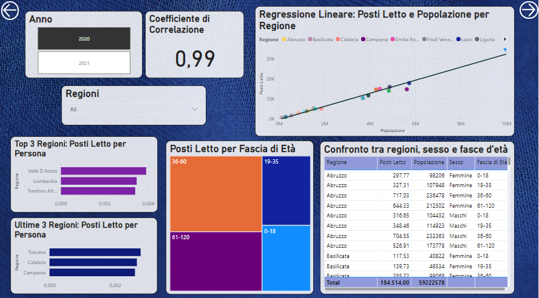
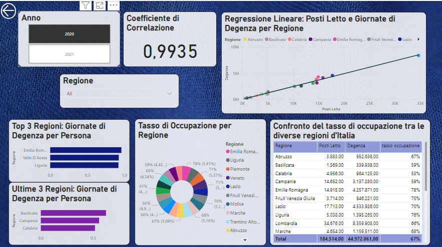

# Project Work

# La Sanità Pubblica

## **Descrizione**
Posti letto e degenze raccontano un'Italia a due velocità.

## **Indice:**
* [Dipendenze](#Dipendenze)
* [Installazione](#Installazione)
* [Obiettivi](#Obiettivi)
* [Schema delle fasi](#Fasi)
* [Primo step: Analisi](#Analisi)
* [Secondo step:Memorizzazione dei dati in un database SQL](#DatabaseSQL)
* [Terzo step: Realizzazione Backend](#Backend)
* [Quarto step: Business Intelligence](#PowerBI)
* [Conclusioni](#Conclusioni)
* [Considerazioni](#Considerazioni)

## **Dipendenze**

1. Python 3.x,
2. Jupyter Notebook,
3. PyCharm,
4. SQL (utilizzando MySQL o simili),
5. PHPMyAdmin (o un'altra interfaccia per gestire il database SQL),
6. Power BI Desktop (per visualizzare il report).

## **Installazione**

1. Clona il repository sul tuo computer.
2. Assicurati di avere tutte le dipendenze installate correttamente.
3. Importa il file SQL nel tuo database utilizzando PHPMyAdmin o un metodo simile.
4. Avvia il backend Python utilizzando PyCharm o Jupyter Notebook.
5. Apri il file del report con Power BI Desktop per visualizzare le analisi dei dati.

## **Obiettivi**

- Fotografare la situazione attuale dal SSN in termini di distribuzione regionale.
- Studiare la relazione tra:
  - Numerosità della popolazione e numero di posti letto ospedalieri.
  - Numero di posti letto e numero di giornate di degenza.
- Formulare conclusioni e considerazioni per il miglioramento del SSN.

## **Fasi**

## **Analisi**

- Recupero dati dalla Banca Dati ISTAT(Istituto Nazionale di Statistica):
    - Primo dataset: posti letto, area di specializzazione clinica, giornate di degenza.
    - Secondo dataset: popolazione divisa per età e genere.
- Data Cleaning con le best practices.
- Analisi statistica: correlazione e regressione lineare per valutare grado di dipendenze delle variabili.

## **DatabaseSQL**

### **Di seguito il Diagramma Entità-Relazione**

## **Backend**

Permette al pubblico di accedere e consultare i dati:
- Creazione del modello delle classi (corrispondente alla tabella esistente sul database).
- Collegamento al database.
- Generazione della risposta al database (Si “traduce” il dato richiesto e si invia l’esito: dato serializzato o assenza/errore).
- Collegamento al server (Porzione di codice che attribuisce alle classi i valori corrispondenti presenti sul database).
- Simulazione del risultato (L’utente richiede il totale deile giornate di degenza per regione e ottiene questo elenco, suddiviso per anno e specializzazione clinica).

## **PowerBI**

## **Conclusioni**

- EVIDENTI DISPARITÀ REGIONALI: 
  Le statistiche dimostrano che il Piemonte ha circa 0,5 posti letto per ogni 100 abitanti mentre la Campania 0.1.

- CORRELAZIONE POSITIVA TRA DATI:
  Si è rinvenuta una correlazione lineare tra popolazione e posti letto, così come tra posti letto e giornate di degenza.

## **Considerazioni**

- LIMITI:
  Complessità dei casi tipologia di posti letto/degenza qualità delle cure.
- ANALISI PIÙ APPROFONDITA:
  Confronto con altri Paesi.
  Valutazione impatto di fattori esterni: invecchiamento popolazione, posti letto d’emergenza.

  

  
